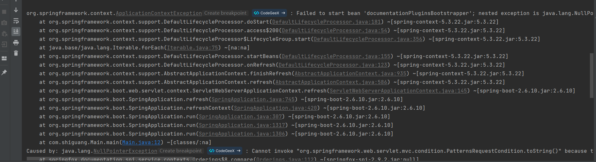

> 示例代码
>
> Gitee: https://gitee.com/an_shiguang/learn-swagger
> 
> GitHub: https://github.com/Shiguang-coding/learn-swagger


# 介绍

Swagger 是一个用于生成、描述、调用和可视化 RESTful Web 服务的开源框架。它通过提供一个用户界面来帮助开发者理解和测试 API。Swagger 2 和 Swagger 3（也称为 OpenAPI 3）是两个主要的版本，它们在集成 Spring Boot 时有一些不同之处。

# Swagger 2 集成 Spring Boot

## 1. 添加依赖

首先，在 `pom.xml` 文件中添加 Swagger 2 的依赖：

```xml
<!-- swagger2 需要 springfox-swagger2以及springfox-swagger-ui -->
<!--访问路径:http://{ip}:{port}/{context-path}/swagger-ui.html-->
<dependency>
    <groupId>io.springfox</groupId>
    <artifactId>springfox-swagger2</artifactId>
    <version>2.9.2</version>
</dependency>
<dependency>
    <groupId>io.springfox</groupId>
    <artifactId>springfox-swagger-ui</artifactId>
    <version>2.9.2</version>
</dependency>
```

**注意**

在springboot2.6.X结合swagger2.9.X会提示`documentationPluginsBootstrapper`空指针异常，原因是在springboot2.6.X中将SpringMVC默认路径匹配策略从`AntPathMatcher`更改为`PathPatternParser`， 导致出错，解决办法是`matching-strategy`切换回之前`ant_path_matcher`


`application.yml`配置文件如下：

```yaml
server:
  port: 8080
  servlet:
    context-path: /

spring:
  application:
    name: learn-swagger

#在springboot2.6.X结合swagger2.9.X会提示documentationPluginsBootstrapper空指针异常，
#原因是在springboot2.6.X中将SpringMVC默认路径匹配策略从AntPathMatcher更改为PathPatternParser，
# 导致出错，解决办法是matching-strategy切换回之前ant_path_matcher
  mvc:
    pathmatch:
      matching-strategy: ant_path_matcher
```

在Spring Boot应用程序中，`mvc`配置用于定义与Spring MVC相关的设置。具体到`pathmatch`配置，它用于控制路径匹配的策略。`matching-strategy`属性指定了路径匹配的具体策略。

在你的配置中：

```yaml
mvc:
  pathmatch:
    matching-strategy: ant_path_matcher
```

`matching-strategy: ant_path_matcher`表示使用Ant风格的路径匹配策略。Ant风格的路径匹配是一种常见的路径匹配模式，它支持通配符和正则表达式。

**Ant风格的路径匹配**

Ant风格的路径匹配支持以下通配符：

- `?`：匹配任意单个字符。
- `*`：匹配任意数量的字符（包括零个字符）。
- `**`：匹配任意数量的字符（包括零个字符），并且可以跨越目录。

例如：

- `com/t?st`：匹配`com/test`，`com/tast`等。
- `com/*.java`：匹配`com`目录下的所有`.java`文件。
- `com/**/test`：匹配`com`目录及其子目录下的所有`test`文件。

**作用**

使用`ant_path_matcher`作为路径匹配策略，可以更灵活地匹配URL路径，从而实现更复杂的路由规则。这在处理RESTful API、静态资源映射、文件上传等场景中非常有用。

**示例**

假设你有一个控制器方法，映射到路径`/users/{id}`：

```java
@GetMapping("/users/{id}")
public User getUser(@PathVariable Long id) {
    // 方法实现
}
```

使用Ant风格的路径匹配，你可以轻松地处理类似`/users/123`、`/users/abc`等路径。

在Spring MVC中，除了Ant风格的路径匹配策略（`ant_path_matcher`），还有其他几种路径匹配策略可供选择。这些策略包括：

1. **`ant_path_matcher`**：使用Ant风格的路径匹配，支持通配符和正则表达式。
2. **`regex_path_matcher`**：使用正则表达式进行路径匹配，提供了更强大的匹配能力。
3. **`path_pattern_parser`**：默认的路径匹配策略，使用Spring的`PathPattern`进行匹配，支持更复杂的路径模式。

**选择策略的考虑因素**

- **性能**：正则表达式匹配通常比Ant风格匹配更慢，但提供了更强大的匹配能力。
- **灵活性**：PathPattern提供了更灵活的路径匹配模式，但可能需要更多的配置。
- **使用场景**：根据你的应用需求选择合适的匹配策略。例如，如果你需要处理复杂的路径模式，正则表达式可能更合适；如果你需要快速开发，Ant风格可能更简单。

## 2. 配置 Swagger

创建一个配置类来启用 Swagger：

```java
package com.shiguang.config;

import org.springframework.context.annotation.Bean;
import org.springframework.context.annotation.Configuration;
import springfox.documentation.builders.ApiInfoBuilder;
import springfox.documentation.builders.PathSelectors;
import springfox.documentation.builders.RequestHandlerSelectors;
import springfox.documentation.service.ApiInfo;
import springfox.documentation.service.Contact;
import springfox.documentation.spi.DocumentationType;
import springfox.documentation.spring.web.plugins.Docket;
import springfox.documentation.swagger2.annotations.EnableSwagger2;


@Configuration
@EnableSwagger2
public class SwaggerConfig {

    @Bean
    public Docket createRestApi() {
        return new Docket(DocumentationType.SWAGGER_2)
            // 配置API的基本信息
            .apiInfo(apiInfo())
            // 是否启用Swagger
            .enable(true)
            // 选择哪些路径需要生成API文档
            .select()
            // 指定哪些类或方法应该被Swagger扫描和文档化
            .apis(RequestHandlerSelectors.basePackage("com.shiguang")) //你自己的package
            // 指定哪些路径应该被Swagger扫描和文档化 any() 所有路径
            .paths(PathSelectors.any())
            .build();
    }


    /**
     * 配置API的基本信息
     */
    private ApiInfo apiInfo() {
        return new ApiInfoBuilder()
            .title("API文档") // 设置API的标题
            .description("这是一个API文档的示例") // 设置API的描述
            .version("1.0.0") // 设置API的版本
            .contact(new Contact("作者", "http://www.example.com", "author@example.com")) // 设置API的联系人信息
            .license("Apache 2.0") // 设置API的许可证名称
            .licenseUrl("http://www.apache.org/licenses/LICENSE-2.0.html") // 设置API的许可证URL
            .termsOfServiceUrl("http://www.example.com/terms") // 设置API的服务条款URL
            .build();
    }
}
```

配置多个分组

```java
@Configuration
@EnableSwagger2
public class SwaggerConfig {

    @Bean
    public Docket defautApi() {
        return new Docket(DocumentationType.SWAGGER_2)
            .groupName("接口管理")
            // 配置API的基本信息
            .apiInfo(apiInfo())
            // 是否启用Swagger
            .enable(true)
            // 选择哪些路径需要生成API文档
            .select()
            // 指定哪些类或方法应该被Swagger扫描和文档化
            .apis(RequestHandlerSelectors.basePackage("com.shiguang.controller")) //你自己的package
            // 指定哪些路径应该被Swagger扫描和文档化 any() 所有路径
            .paths(PathSelectors.any())
            .build();
    }

    @Bean
    public Docket userApi() {
        return new Docket(DocumentationType.SWAGGER_2)
            .groupName("用户管理")
            // 配置API的基本信息
            .apiInfo(apiInfo())
            // 是否启用Swagger
            .enable(true)
            // 选择哪些路径需要生成API文档
            .select()
            // 指定哪些类或方法应该被Swagger扫描和文档化
            .apis(RequestHandlerSelectors.basePackage("com.shiguang.controller")) //你自己的package
            // 指定哪些路径应该被Swagger扫描和文档化
            .paths(PathSelectors.ant("/user/**"))
            .build();
    }

    @Bean
    public Docket orderApi() {
        return new Docket(DocumentationType.SWAGGER_2)
            .groupName("订单管理")
            // 配置API的基本信息
            .apiInfo(apiInfo())
            // 是否启用Swagger
            .enable(true)
            // 选择哪些路径需要生成API文档
            .select()
            // 指定哪些类或方法应该被Swagger扫描和文档化
            .apis(RequestHandlerSelectors.basePackage("com.shiguang.controller")) //你自己的package
            // 指定哪些路径应该被Swagger扫描和文档化
            .paths(PathSelectors.ant("/order/**"))
            .build();
    }


    /**
     * 配置API的基本信息
     */
    private ApiInfo apiInfo() {
        return new ApiInfoBuilder()
            .title("API文档") // 设置API的标题
            .description("这是一个API文档的示例") // 设置API的描述
            .version("1.0.0") // 设置API的版本
            .contact(new Contact("作者", "http://www.example.com", "author@example.com")) // 设置API的联系人信息
            .license("Apache 2.0") // 设置API的许可证名称
            .licenseUrl("http://www.apache.org/licenses/LICENSE-2.0.html") // 设置API的许可证URL
            .termsOfServiceUrl("http://www.example.com/terms") // 设置API的服务条款URL
            .build();
    }
```


### 各配置项说明

`Docket`是Springfox OpenAPI 3.x版本中用于配置Swagger的类。它提供了许多方法来定制Swagger的行为和外观。以下是一些常用的`Docket`方法：

#### **`apiInfo()`**

用于配置API的基本信息，如标题、描述、版本、联系人等。


```java
apiInfo(ApiInfo apiInfo)
```

#### `enable()`

用于启用或禁用Swagger。

```java
Docket enable(boolean enabled)
```

#### **`select()`**

用于配置API的路径选择器，可以指定哪些路径应该被Swagger扫描和文档化。

```java
@Bean
public Docket api() {
    return new Docket(DocumentationType.SWAGGER_2)
            .select()
            .apis(RequestHandlerSelectors.basePackage("com.example.controller"))
            .paths(PathSelectors.any())
            .build();
}
```

#### **`apis()`**

用于配置API的选择器，可以指定哪些类或方法应该被Swagger扫描和文档化。

```java
@Bean
public Docket api() {
    return new Docket(DocumentationType.SWAGGER_2)
            .select()
            .apis(RequestHandlerSelectors.withMethodAnnotation(GetMapping.class))
            .build();
}
```

#### **`paths()`**

用于配置API的路径选择器，可以指定哪些路径应该被Swagger扫描和文档化。

```java
@Bean
public Docket api() {
    return new Docket(DocumentationType.SWAGGER_2)
            .select()
            .paths(PathSelectors.regex("/api/.*"))
            .build();
}
```


**PathSelectors**

`PathSelectors`是一个工具类，提供了多种方法来选择路径。常用的方法包括：

- `any()`：选择所有路径。
- `none()`：不选择任何路径。
- `ant(String antPattern)`：根据Ant风格的路径模式选择路径。
- `regex(String regexPattern)`：根据正则表达式选择路径。
- `withClassAnnotation(Class<? extends Annotation> annotation)`：根据类上的注解选择路径。
- `withMethodAnnotation(Class<? extends Annotation> annotation)`：根据方法上的注解选择路径。

例如，`PathSelectors.regex("/api/.*")`会选择所有以`/api/`开头的路径。

通过以上方法，你可以灵活地配置Swagger，以满足你的需求。你可以根据你的项目需求，选择合适的方法来定制Swagger的行为和外观。


#### **`ignoredParameterTypes()`**

用于配置应该被忽略的参数类型。

```java
Docket ignoredParameterTypes(Class<?>... types)
```

#### `additionalModels()`

用于配置额外的模型类。

```java
Docket additionalModels(Class<?>... classes)
```

#### `directModelSubstitute()`

用于配置模型类的直接替换。

```java
Docket directModelSubstitute(Class<?> type, Class<?> substitute)
```

#### `genericModelSubstitutes()`

用于配置模型类的泛型替换。

```java
Docket genericModelSubstitutes(Class<?>... types)
```

#### `useDefaultResponseMessages()`

```java
Docket useDefaultResponseMessages(boolean useDefaultResponseMessages)
```

#### `globalResponseMessage()`

用于配置全局的响应消息。

```java
Docket globalResponseMessage(boolean globalResponseMessage, List<ResponseMessage> responseMessages)
```

#### `globalOperationParameters()`

用于配置全局的操作参数

#### `securitySchemes()`

用于配置安全方案。

```java
Docket securitySchemes(List<SecurityScheme> securitySchemes)
```

#### `securityContexts()`

用于配置安全上下文。

```java
Docket securityContexts(List<SecurityContext> securityContexts)
```


#### `pathMapping()`

用于配置路径映射。

```java
Docket pathMapping(String pathMapping)
```


## 3. 访问 Swagger UI

启动 Spring Boot 应用后，可以通过以下 URL 访问 Swagger UI：

访问地址：

```bash
http://{ip}:{port}/{context-path}/swagger-ui.html
```


{ip}: 是你的服务器IP地址。

{port}: 是你的应用服务端口，通常为8080。

{context-path}: 是你的应用上下文路径，如果应用部署在根路径下，则为空。

例如：

```bash
http://localhost:8080/swagger-ui.html
```


# Swagger 3  集成 Spring Boot

## 1. 添加依赖

在 `pom.xml` 文件中添加 Swagger 3 的依赖：

```xml
<!-- swagger3 -->
<!--访问路径: http://{ip}:{port}/{context-path}/swagger-ui/index.html-->
<dependency>
    <groupId>io.springfox</groupId>
    <artifactId>springfox-boot-starter</artifactId>
    <version>3.0.0</version>
</dependency>
```

## 2. 配置 Swagger

`@EnableOpenApi` 注解替代 swagger2 的 `@EnableSwagger2` 注解，创建 Docket 时使用 `DocumentationType.OAS_30`，而不是之前的 `DocumentationType.SWAGGER_2`。其他注解如 `@ApiModel` 使用方式都一样。

```java
package com.shiguang.config;

import org.springframework.context.annotation.Bean;
import org.springframework.context.annotation.Configuration;
import springfox.documentation.builders.ApiInfoBuilder;
import springfox.documentation.builders.PathSelectors;
import springfox.documentation.builders.RequestHandlerSelectors;
import springfox.documentation.oas.annotations.EnableOpenApi;
import springfox.documentation.service.ApiInfo;
import springfox.documentation.service.Contact;
import springfox.documentation.spi.DocumentationType;
import springfox.documentation.spring.web.plugins.Docket;


@Configuration
@EnableOpenApi
public class SwaggerConfig {

    @Bean
    public Docket createRestApi() {
        return new Docket(DocumentationType.OAS_30)
            // 配置API的基本信息
            .apiInfo(apiInfo())
            // 是否启用Swagger
            .enable(true)
            // 选择哪些路径需要生成API文档
            .select()
            // 指定哪些类或方法应该被Swagger扫描和文档化
            .apis(RequestHandlerSelectors.basePackage("com.shiguang.controller")) //你自己的package
            // 指定哪些路径应该被Swagger扫描和文档化 any() 所有路径
            .paths(PathSelectors.any())
            .build();
    }


    /**
     * 配置API的基本信息
     */
    private ApiInfo apiInfo() {
        return new ApiInfoBuilder()
            .title("API文档") // 设置API的标题
            .description("这是一个API文档的示例") // 设置API的描述
            .version("1.0.0") // 设置API的版本
            .contact(new Contact("作者", "http://www.example.com", "author@example.com")) // 设置API的联系人信息
            .license("Apache 2.0") // 设置API的许可证名称
            .licenseUrl("http://www.apache.org/licenses/LICENSE-2.0.html") // 设置API的许可证URL
            .termsOfServiceUrl("http://www.example.com/terms") // 设置API的服务条款URL
            .build();
    }
}
```


## 3. 访问 Swagger UI

启动 Spring Boot 应用后，可以通过以下 URL 访问 Swagger UI：

访问地址：

```
http://{ip}:{port}/{context-path}/swagger-ui/index.html
```

例如：

```bash
http://localhost:8080/swagger-ui/index.html
```


# Swagger常用注解

## `@Api`

用于类上，描述整个类的信息，如描述、作者等。

```java
@Api(tags = "用户管理", description = "用户相关的API")
public class UserController {
    // ...
}

```

## `@ApiOperation`

用于方法上，描述单个API操作的信息，如操作描述、响应类型等。

```java
@ApiOperation(value = "获取用户信息", notes = "根据用户ID获取用户信息")
@GetMapping("/{id}")
public User getUserById(@PathVariable Long id) {
    // ...
}
```

##  `@ApiParam`

用于方法参数上，描述参数的信息，如参数名、描述、是否必填等。

```java
@ApiOperation(value = "获取用户信息")
@GetMapping("/{id}")
public User getUserById(@ApiParam(value = "用户ID", required = true) @PathVariable Long id) {
    // ...
}
```

## `@ApiModel`

用于类上，描述模型类的信息，如模型名、描述等。

```java
@ApiModel(value = "用户信息", description = "用户信息的模型")
public class User {
    // ...
}
```

## `@ApiModelProperty`

用于模型类的属性上，描述属性的信息，如属性名、描述、是否必填等。

```java
@ApiModelProperty(value = "用户ID", required = true)
private Long id;

@ApiModelProperty(value = "用户名", required = true)
private String username;
```


## `@ApiResponse`

用于方法上，描述API响应的信息，如响应码、描述、响应模型等。

```java
@ApiOperation(value = "获取用户信息")
@GetMapping("/{id}")
@ApiResponse(code = 200, message = "成功", response = User.class)
@ApiResponse(code = 404, message = "用户不存在")
public User getUserById(@PathVariable Long id) {
    // ...
}
```

## `@ApiResponses`

用于方法上，描述多个API响应的信息。

```java
@ApiOperation(value = "获取用户信息")
@GetMapping("/{id}")
@ApiResponses({
    @ApiResponse(code = 200, message = "成功", response = User.class),
    @ApiResponse(code = 404, message = "用户不存在")
})
public User getUserById(@PathVariable Long id) {
    // ...
}
```

## `@ApiIgnore`

用于方法或类上，忽略该API或方法，不生成文档。

```java
@ApiIgnore
@GetMapping("/ignore")
public String ignore() {
    // ...
}
```


# Swagger2与Swagger主要区别

1. **依赖库**：
   - Swagger 2 使用 `springfox-swagger2` 和 `springfox-swagger-ui`。
   - Swagger 3 使用 `springdoc-openapi-ui`。
2. **配置方式**：
   - Swagger 2 需要显式的配置类，并使用 `@EnableSwagger2` 注解。
   - Swagger 3 不需要显式的配置类，它会自动扫描并生成文档。
3. **注解和 API**：
   - Swagger 2 使用 `@Api`、`@ApiOperation` 等注解来描述 API。
   - Swagger 3 使用 OpenAPI 3 规范，注解略有不同，但通常不需要额外的注解，Spring Boot 的注解（如 `@RestController`、`@GetMapping` 等）已经足够。
4. **用户体验**：
   - Swagger 3 的 UI 界面更加现代化，用户体验更好。

## 总结

- **Swagger 2** 需要显式的配置类和注解，依赖于 `springfox` 库。
- **Swagger 3** 更加简洁，自动扫描并生成文档，依赖于 `springdoc` 库。

如果你正在开始一个新的项目，建议使用 Swagger 3，因为它更符合现代开发实践，并且配置更加简单。


# 自定 Swagger 配置

虽然 Swagger 3 不需要显式的配置类，但你仍然可以通过配置文件或代码来自定义 Swagger 的行为。

##  配置文件

你可以在 `application.properties` 或 `application.yml` 文件中添加以下配置：

```properties
springdoc.api-docs.path=/api-docs
springdoc.swagger-ui.path=/swagger-ui.html
```

## 代码配置

```java
import org.springdoc.core.GroupedOpenApi;
import org.springframework.context.annotation.Bean;
import org.springframework.context.annotation.Configuration;

@Configuration
public class SwaggerConfig {

    @Bean
    public GroupedOpenApi publicApi() {
        return GroupedOpenApi.builder()
                .group("public-api")
                .pathsToMatch("/public/**")
                .build();
    }

    @Bean
    public GroupedOpenApi adminApi() {
        return GroupedOpenApi.builder()
                .group("admin-api")
                .pathsToMatch("/admin/**")
                .build();
    }
}
```
